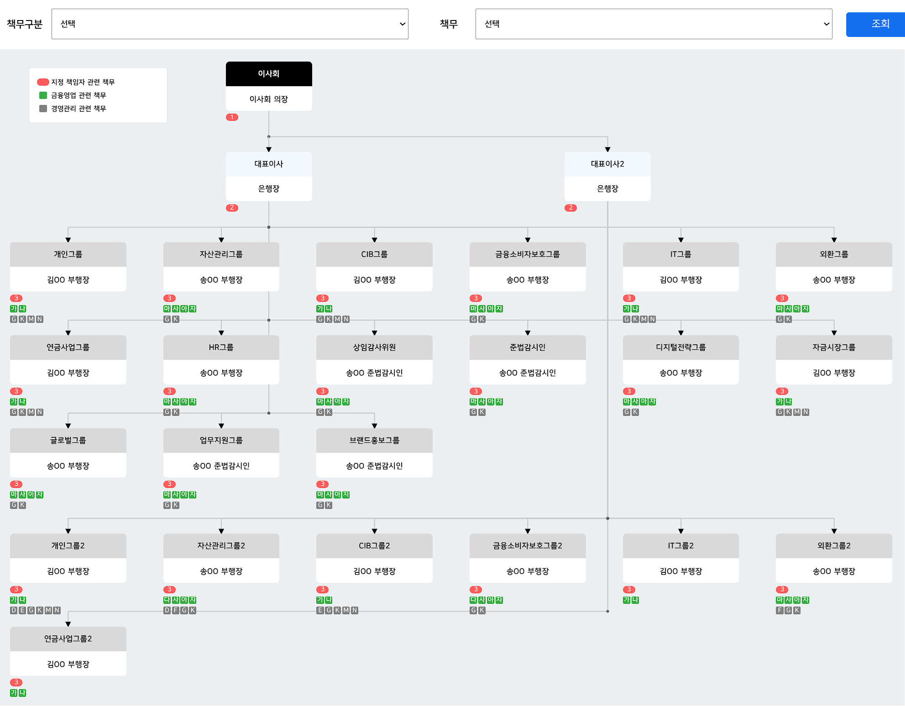

# 책무 구조도

## Environment
Vue3, composition API

## Features
1. search area에서 책무 필터링 검색 시 책무가 할당된 그룹만 보여줌
2. 책무 선택 시 책무에 해당되는 세부 책무 list 자동 생성 (데이터 구현 필요)
3. 화면에서 요소 위치 변경시 연결선도 자동으로 이동 (반응형 적용)
4. 각 그룹 클릭 시 이벤트 생성
5. 책무 상세 설명은 왼쪽 상단 hover시 볼 수 있다. (기능만 구현)

## View

